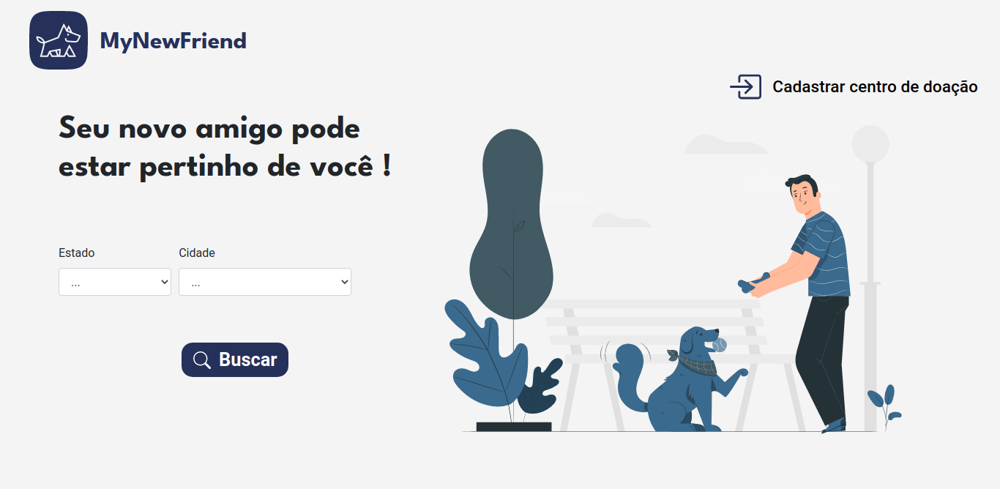
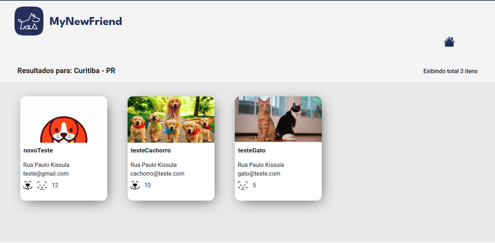
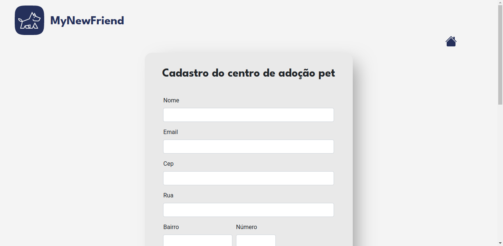
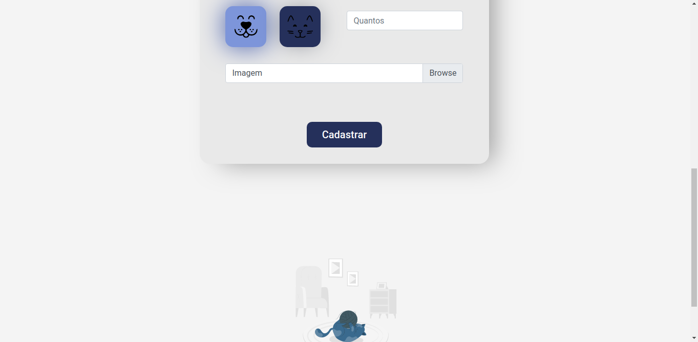

# MyNewFriend :cat: :dog:

Este projeto foi inspirado na 1° Next Level Week 2020. Porém, ao invés de React, eu construí ele utilizando Django, e no banco de dados, é utilizado PostgreSQL.

A ideia desse projeto é ter um espaço onde pessoas que estão procurando adotar um novo amigo, podem se conectar as pessoas que estão realizando a doação. Portanto, os indivíduos que estão realizando a doação, podem facilmente preencher o cadastro, contendo as informações mais importantes, e aqueles que procuram adotar um pet, em sua cidade, poderão encontrá-los.

## Telas

### Home

### Busca

### Cadastro

## Considerações finais
Estes links foram úteis durante o desenvolvimento:
- [Prototipo](https://www.figma.com/file/wEQ9tApiKU7VS8SLegZXMg/MyNewFriend?node-id=0%3A1)

- [form](https://simpleisbetterthancomplex.com/article/2017/08/19/how-to-render-django-form-manually.html)

- [form/ajax](https://realpython.com/django-and-ajax-form-submissions/)

- [estrutura](https://developer.mozilla.org/pt-BR/docs/Learn/Server-side/Django/skeleton_website)

- [bootstrap](https://dev.to/thalesbruno/django-projeto-generico-com-bootstrap-3d86)
